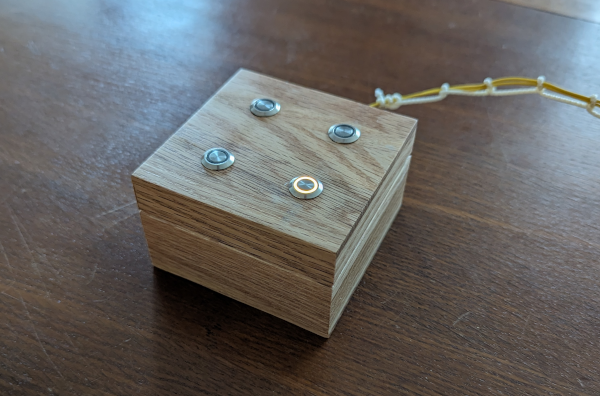
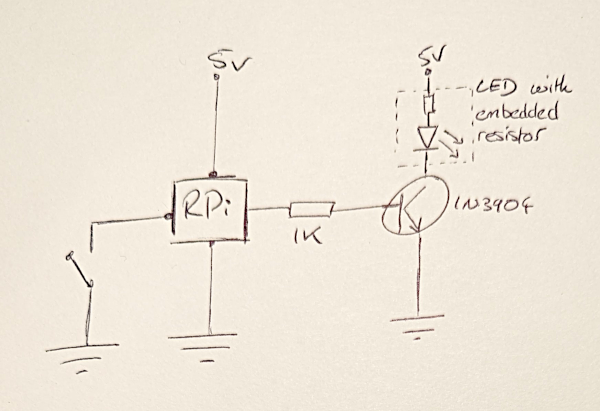
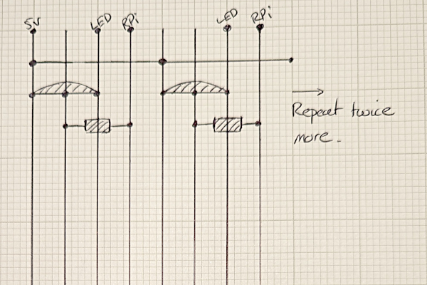

Four Buttons
============

A machine with four light up buttons in a pretty box.  It reminds you to do certain tasks, like water the plants, on a set schedule.  Also an excuse to learn Rust.

## Pre-requisites

* docker or [podman](https://podman.io/docs/installation).
* `cargo install cross` - for cross compilation

## Usage

* Run locally with `USE_FAKE_RPI=1 RUST_LOG=debug cargo run`.
* Release with `./release.sh`.
* Autoformat code with `cargo fmt`.

## Pretty pictures

## Circuits

A circuit diagram showing a single LED and button, in reality there are 4 of each.

The stripboarded elements (transistor & resistor):

## First time Raspberry Pi Configuration

Automatically connect to the wifi on startup:
1. `nmcli device wifi connect "<SSID>" password "<password>"`
2. `nmcli connection up "<SSID>"`
3. `nmcli connection mod "<SSID>" connection.autoconnect yes`
(To see if the wifi is connected: `nmcli connection show`)

Manually reserved 192.168.0.94 on the router.

## TODO

Some things I could do?  But who has the time.
* Devcontainer with pinned rust version, clippy version, etc
* "Better" error types (what does this mean in rust?  anyhow?)
* Try out an Actor framework like Actix?  I seem to have written some crap
  actors by accident already.  Relatedly, actually test the core notification
  logic which is currently all tied up with threads.
* Store scheduler state in DB.
* Work out how to avoid all these messy unwraps.
